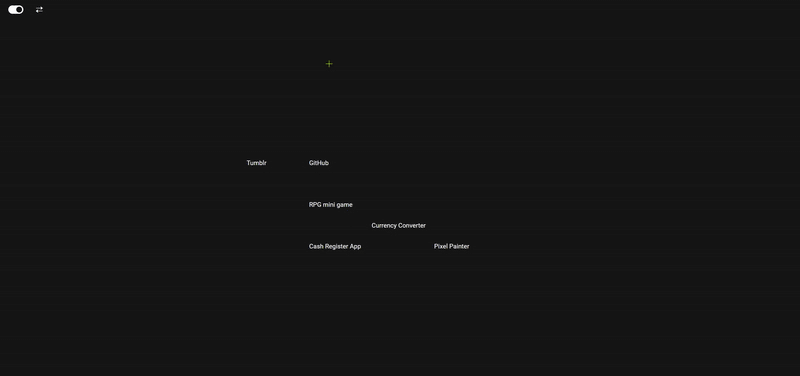

# Portfolio

This site showcases various projects I have worked on, along with a few, fun interactive feature.

## Live Demo

→ [Portfolio](https://pedroalves-dv.github.io/)

## Features

### 🎨 Interactive Canvas

- **Description**: An interactive canvas is included on the homepage.
- **Implementation**: Users can draw on the canvas, and the drawing state is managed using JavaScript.

### 🔄 Layout Toggle

- **Description**: Users can switch between different layout modes (e.g., grid and vertical).
- **Implementation**: The layout toggle button allows users to change the layout dynamically.

### 🖼️ Project "Peek" Previews

- **Description**: Hovering over project links displays a preview of the project.
- **Implementation**: Previews are shown using pre-generated screenshots stored in the `assets/images/` directory.

### 🌙 Dark Mode Toggle

- **Description**: Users can switch between light and dark modes using the toggle switch.
- **Implementation**: The dark mode preference is stored in `localStorage` to persist across sessions.

## Projects

### Pixel Painter

- **Description**: A pixel art drawing application.
- **Link**: [Pixel Painter](https://pedroalves-dv.github.io/pixelpainter/)

### Meridian

- **Description**: A time tracker for global timezones.
- **Link**: [Meridian](https://meridian-time.vercel.app/)

### Currency Converter

- **Description**: An application to convert currencies.
- **Link**: [Currency Converter](https://pedroalves-dv.github.io/euro-converter/)

### RPG Mini Game

- **Description**: A small role-playing game.
- **Link**: [RPG Mini Game](https://pedroalves-dv.github.io/dragon-repeller/)

### Cash Register App

- **Description**: An application to manage cash transactions.
- **Link**: [Cash Register App](https://pedroalves-dv.github.io/cash-register/)

## Technologies Used

- **HTML**: For structuring the content.
- **CSS**: For styling the website.
- **JavaScript**: For interactive features and dynamic content.
- **LocalStorage**: For persisting user preferences (e.g., dark mode).

## License

MIT

## Contact

For any inquiries, please contact me at [pedroalves.dv@gmail.com].